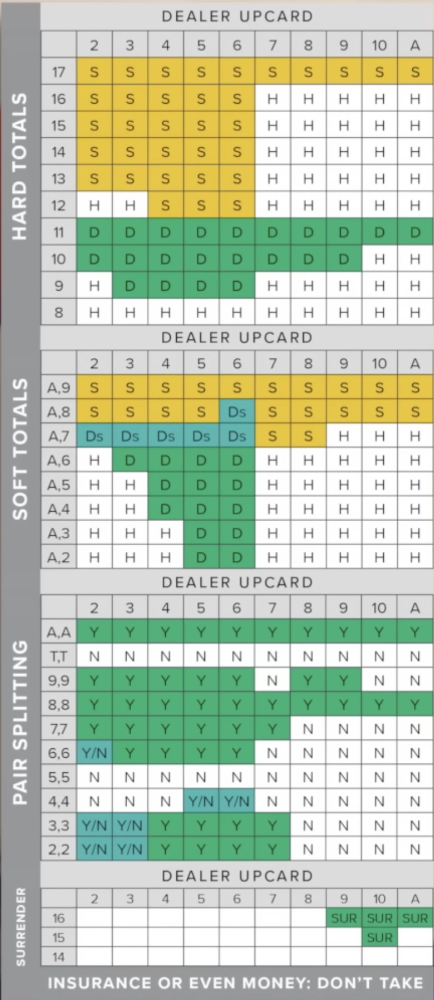

# ESSENTIAL
* we need to have a greater value than the dealer without being over 21
* 21 is the best hand
* dealer needs to keep hitting until they hit 17 or greater
* JKQ = 10
* A = 1 or 11, whichever is better for the hand
* A + 10 value card = 21
* Blacjack pays 3:2, you don't want to play 6:5

## Payouts:
* Player wins, players wins equal amount to what they bet
* if player lose, they lose what they bet
* player checks, they don't win or lose
* if you are dealt a blackjack, u auto win 
## Our Plays
* we can double, allowing us to double our bet and receive one final card
* we can split allowing us to split allowing us to turn our one hand into two hands
* hitting, standing, doubling down
* you can only double down on first 2 cards, you can place equal bet to your first bet, you should only double down when ur 
* doubling down are all situatiosn where you have advantageous hands
* splitting is when you have two cards of equal value to each other. you put a second equal bet out, and it gets split, you can keep splitting as long as you pull the same card
  * for pair of aces, you only get one card that you can hit
* if dealer has an ace up, the player, can put half his stack in insurance, you basically put everything into insurance, so you can back out
* surrender, is sometimes offerred, you say surrender, you forfeit your hand and only lose half your bet

## Shitter Casino Things:
* 6:5 for blackjack
* we go first when we play against the casino

## How Can we win?
* 26 Cards red, 26 Black.
* Roulette wheels abuse human psychology, cuz history of wheel doesn't make a diff
* Blackjack, after you place a bet, the top card is taken out of the deck and removed for the next round
  * we can keep a tally of the cards in the deck

## How to card count:
* Blackjack has a memory
* Fundmanetals
  * 
  * purely mathematical

## Running Count:
* High Low
  * 2 through 6 are worth 1
  * 789 are worth 0
  * 10 through Ace are worht -1
* Every single card is counted, keep tracking it 
* We need to keep track of the true count to decide when we bet big
  * pond is how many decks left in the shoe
  * we need to know how many decks are left in play
    * we can ask how many decks
    * we need to keep track of running count and how many decks are left in play
    * deck estimation is looking at a pile of cards
* True count = running count / num decks remaining, we round(true whatever)
### How to use a true count:
* at a true 1 you have an advantage, increases by a small percentage every true count. Bet big every percentage. Sometimes you bet big every high true count, bet low every small Count.
* You can modify a true count play style, deviations are where you can basically play "theorietically suboptimally but in a good sitatuion boosts your odds"
* you need to carefully calculate your bet spread, don't go bust

## Small Side Rules:
So you can only split if you get two of the same suit(same number bs)